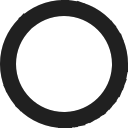

<div align="center">
<p>
    <a href="https://www.youtube.com/embed/FYBRVgq3kfs?si=ypbDvkBNWpyWaouh" target="_blank">
        
    </a>
</p>

[Surkl 0.3.0](https://www.youtube.com/watch?v=FYBRVgq3kfs)
===========

A node-based file browser for the desktop.

⚠ Currently in development. Expect bugs, missing features and breaking changes.! ⚠

</div>

Features
--------

* node-based architecture
* persistent UI
* multi-window tiling manager
* theme generator

Dependencies
------------
* Qt 6.x
* C++23

Build
-----

```
* git clone https://github.com/Arlen/Surkl.git
* cd Surkl
* cmake . -B ./build -D CMAKE_BUILD_TYPE=Release
* cmake --build build/ --target surkl --parallel
```

Documentation
-------------
Please see built-in documentation.